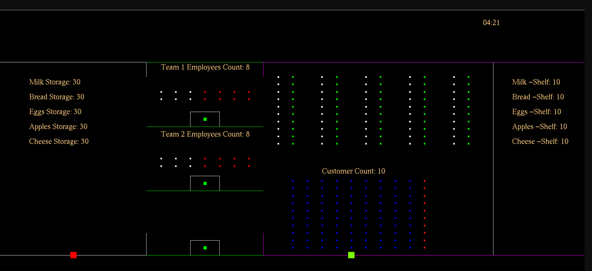

# Supermarket Product Shelving Simulation

> A real-time, multi-process, multi-threaded supermarket simulator written in C, with a live OpenGL/GLUT visualization layer.



Built for the **Real-Time Systems** course at Birzeit University, supervised by **Prof. Hanna Bullata**. The project models concurrent supermarket operations — customers, shelving teams, storage, and a wall clock — using POSIX processes, POSIX threads, semaphores, and shared memory, all driven by user-tunable simulation parameters.

A short demo recording is hosted alongside this README:
<https://github.com/user-attachments/assets/61c4a03a-24f4-4293-80a8-0c4d98de6355>

---

## Highlights

- **Five cooperating Unix processes** coordinated through System V shared memory and semaphores.
- **Multi-threaded shelving teams** — each manager owns a worker pool that refills shelves when stock dips below a configurable threshold.
- **Configurable customer model** — arrival rate, shopping time, basket size, and item quantity are all data-driven.
- **Live OpenGL visualization** of storage, shelves, both shelving teams, and the customer grid, with a synchronized wall clock.
- **Deterministic shutdown** — the simulation ends cleanly when stock is depleted or the configured closing time is reached.

---

## Architecture

`main` is the orchestrator. It reads `config.txt`, sets up the IPC primitives (shared memory + semaphore sets), then forks and `execlp`s the four worker binaries:

| Binary | Role |
| --- | --- |
| `main` | Orchestrator. Reads config, owns the IPC primitives, forks children, handles shutdown. |
| `customer` | Spawns customer agents at a randomized arrival rate; each picks items and decrements shelf stock under a semaphore. |
| `shelving_team` | Multi-threaded restocker. Manager threads dispatch worker threads to refill shelves from storage when below threshold. |
| `drawer` | OpenGL/GLUT renderer. Reads the shared state on each frame and paints shelves, storage, teams, customers, and the clock. |
| `timer` | Drives the simulated wall clock and the open/close window. |

### Synchronization primitives

- **POSIX semaphores** (`sys/sem.h`) — guard each shelf, each storage bin, and the customer queue.
- **POSIX threads** (`pthread.h`) — drive the worker pool inside `shelving_team` and the concurrent customer agents inside `customer`.
- **Shared memory** (`sys/shm.h`) — one block holds shelf counts, storage counts, customer roster, and clock state.
- **Signals + `waitpid`** — `main` cleans up children and IPC primitives on shutdown.

---

## Repository Layout

```
.
├── README.md
├── makefile               # Builds the five binaries into the repo root
├── run.sh                 # Convenience wrapper: make && ./main
├── config.txt             # Tunable simulation parameters
├── names.txt              # Customer-name pool
├── supermarket_items.txt  # Product catalogue
├── src/                   # Translation units
│   ├── main.c
│   ├── customer.c
│   ├── drawer.c
│   ├── shelving_team.c
│   └── timer.c
├── include/               # Shared headers (IPC keys, struct defs, prototypes)
│   ├── constants.h
│   ├── customer_header.h
│   ├── functions.h
│   ├── header.h
│   ├── processing_times.h
│   ├── semphores.h
│   ├── shared_memories.h
│   └── shelving_team.h
└── docs/
    └── showcase.png       # Rendered simulation frame
```

The compiled binaries (`main`, `customer`, `drawer`, `timer`, `shelving_team`) land in the repo root because `main` execs them by relative path (`./customer`, `./drawer`, …).

---

## Build & Run

### Requirements

POSIX-only. Tested on Ubuntu. macOS / Windows native are not supported because the code relies on `sys/sem.h`, `sys/shm.h`, `sys/msg.h`, and GLUT.

On Debian / Ubuntu:

```bash
sudo apt update
sudo apt install build-essential freeglut3-dev libglu1-mesa-dev libgl1-mesa-dev
```

### Build

```bash
make
```

### Run

```bash
./run.sh
# equivalent to: make && ./main
```

The simulation terminates when stock is depleted or the configured end-time is reached, whichever comes first. `make clean` removes all compiled binaries.

---

## Configuration

Every tunable lives in [`config.txt`](config.txt):

| Key | Description |
| --- | --- |
| `customerCapacity` | Maximum concurrent customers in the store |
| `interval_seconds` | Tick interval used by the timer process |
| `SHOPPING_TIME_Max` | Upper bound on per-customer shopping time |
| `numberOfProducts` | Number of distinct products on shelves |
| `amountPerProductOnShelves` | Initial shelf stock per product |
| `amountPerProductInStorage` | Initial storage stock per product |
| `numberOfShelvingTeams` | Manager threads in `shelving_team` |
| `numberOfEmployeesPerTeam` | Worker threads per manager |
| `productRestockThreshold` | Shelf level that triggers restocking |
| `minCustomerArrivalRate` / `maxCustomerArrivalRate` | Bounds on the customer arrival generator |
| `maxItemsPerCustomer` | Maximum distinct items in a customer's basket |
| `maxQuantityPerItem` | Maximum quantity of any single item |
| `startHour` / `startMinute` | Simulated open time |
| `endHour` / `endMinute` | Simulated close time |

`names.txt` and `supermarket_items.txt` provide the customer-name pool and product catalogue, respectively.

---

## Course & Acknowledgements

- **Course:** Real-Time Systems, Birzeit University · Faculty of Engineering & Technology
- **Supervisor:** Prof. Hanna Bullata
- **Team project** — see commit history for individual contributions.
